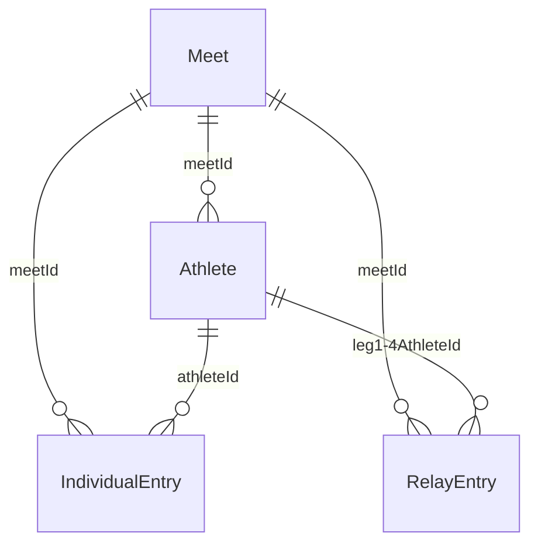

# championshipentries data model

This documents the data model behind the `championshipentries` app: what's persisted, how the pieces relate, and what's computed on demand instead of stored.
Source of truth is the code — `src/types.ts`, `src/storage.ts`, and `src/domain/meetBackup.ts` — this doc explains the *why* behind the shape.

## Overview

There is no backend.
The entire app's state is one JSON object, `AppData`, held in React state and written to `localStorage` wholesale on every change (`src/storage.ts`).
Undo/redo (`src/hooks/useHistory.ts`) operates on `AppData` as a single unit — every mutation replaces the whole object, not a targeted slice of it.

`AppData` is a flat, denormalized relational model: four arrays joined by string IDs, not nested objects.



```ts
interface AppData {
  meets: Meet[];
  athletes: Athlete[];
  individualEntries: IndividualEntry[];
  relayEntries: RelayEntry[];
}
```

## Entities

### `Meet`

One meet a coach is entering a roster for.

| Field | Type | Notes |
|---|---|---|
| `id` | `string` | Primary key (`crypto.randomUUID()`, see `src/utils/id.ts`). |
| `name` | `string` | |
| `teamCode?` | `string` | MIAA/Hy-Tek team code. Resolved against `HighSchool[]` (see below) at export time to fill in the team's full name for the HY3 file. |
| `importedEventsFileName?` | `string` | Display-only — the filename of the last imported `.ev3` file. |
| `importedEventsRaw?` | `string` | The imported EV3 file's full raw text. This is the **sole source of truth for a meet's events** — see [Events are derived, not stored](#events-are-derived-not-stored) below. |
| `maxIndividualEventsPerAthlete?` `maxRelayEventsPerAthlete?` `maxTotalEventsPerAthlete?` | `number` | From `AthleteEventLimits`, all optional on `Meet` (`Partial<AthleteEventLimits>`). Per-athlete entry-count caps, enforced only as a warning (`domain/eventSummary.ts`), not a hard block. |
| `individualEventEntryLimit?` `relayEventEntryLimit?` | `number` | From `EventEntryLimits`, all optional on `Meet` (`Partial<EventEntryLimits>`). Per-event team entry-count caps — a meet-wide policy the coach sets, not something EV3 carries. Also warning-only. |

A `MeetTemplate` (`src/domain/meetTemplates.ts`, not persisted in `AppData`) is the non-optional version of the same limits plus an `ev3Url` to fetch events from, a `genderFilter`, and stub-row counts — it's what "Copy template into a new meet" materializes into a real `Meet`.

### `Athlete`

| Field | Type | Notes |
|---|---|---|
| `id` | `string` | Primary key. |
| `meetId` | `string` | FK → `Meet.id`. |
| `lastName` / `firstName` | `string` | |
| `gender` | `GenderAge` (`"M" \| "B" \| "W" \| "G"`) | The Hy-Tek *age-weighted* gender alphabet (Men/Boys/Women/Girls), not plain `"M" \| "F"` — matches the HY3 `E1`/`F1` encoding. See `src/hytek/enums.ts`. |
| `classYear` | `number \| null` | Graduating class year, e.g. `2027`. |

### `IndividualEntry`

| Field | Type | Notes |
|---|---|---|
| `id` | `string` | Primary key. |
| `meetId` | `string` | FK → `Meet.id`. |
| `athleteId` | `string` | FK → `Athlete.id`. `""` means no athlete selected yet. |
| `event` | `number` | FK to an event — the EV3 `eventNumber` (`ImportedEvent.eventNumber`), **not** a row in any persisted table. `0` means no event selected yet. See [Events are derived, not stored](#events-are-derived-not-stored). |
| `seedTime` | `string` | Normalized `M:SS.hh` / `SS.hh` (swimming) or `SSS.hh` (diving score) — see `src/utils/seedTime.ts`. `""` means blank. |

### `RelayEntry`

Same shape as `IndividualEntry`, but a relay has exactly four legs rather than one athlete — Hy-Tek relays are always 4 legs, so this is four flat fields rather than a nested array.

| Field | Type | Notes |
|---|---|---|
| `id` | `string` | Primary key. |
| `meetId` | `string` | FK → `Meet.id`. |
| `event` | `number` | Same EV3 `eventNumber` FK as `IndividualEntry.event`. |
| `relayLetter` | `string` | `"A"` / `"B"` / `"C"` / `"D"` — which of the team's relays in this event. |
| `leg1AthleteId` … `leg4AthleteId` | `string` | FK → `Athlete.id` each, `""` if that leg is unfilled. |
| `seedTime` | `string` | Same encoding as `IndividualEntry.seedTime`. |

### `HighSchool` (not persisted)

```ts
interface HighSchool {
  code: string;
  school: string;
  town: string;
  county: string;
}
```

Fetched read-only from a CSV in the `baystateconference` repo (`src/domain/highSchools.ts`) at export time, keyed by `Meet.teamCode`, to fill in the team's full name/town for the HY3 output.
Never stored in `AppData`.

## Events are derived, not stored

Events live *only* as `Meet.importedEventsRaw` — the raw text of the imported `.ev3` file.
Every other shape the app uses for events is computed from that raw text on demand, never persisted alongside it:

- **`ImportedEvent`** (`src/types.ts`) — the lightweight per-event summary the UI needs (number, round, relay flag, gender, distance, stroke code, scheduled time, display name, qualifying standard). Produced by `parseEv3()` in `src/domain/ev3.ts`.
- **`EventOption`** (`eventNumber`, `name`, `gender`) — one entry per unique display name (an event with separate EV3 prelim/final rows collapses to one option), used to populate the event dropdowns. Produced by `uniqueEventOptions()`.
- **`Ev3File`** (`src/hytek/ev3/types.ts`) — the fully-detailed parse (every EV3 field, including age ranges the `ImportedEvent` summary doesn't carry), re-parsed from `importedEventsRaw` only when `Export to HY3` needs it (`src/domain/hy3Export.ts`).

This is a deliberate normalization: `Meet.importedEvents` used to also be stored as a parsed array alongside the raw text, but that was pure redundant storage (every byte of it re-derivable from `importedEventsRaw`) that bloated both `localStorage` and every meet backup export.
It now has to be recomputed (cheap — a few dozen semicolon-delimited lines) instead of kept in sync by hand at every write site.

`IndividualEntry.event` / `RelayEntry.event` key off the EV3 `eventNumber` (the format's actual primary key — see `docs/hytek/ev3-spec.md` field 1) rather than the formatted display name, so re-importing a corrected EV3 file or tweaking the display-name formatter can't silently orphan existing entries the way a string-keyed join would.

## Persistence

### `localStorage`

Key: `championshipentries:data`.
Value: `AppData` with a `version` number spliced in at the top level (`{ version, meets, athletes, individualEntries, relayEntries }`), written via `JSON.stringify` on every state change (`src/storage.ts`).

`version` exists purely as a migration hook — `loadData()` runs the parsed blob through `migrate()`, which is where a future breaking change to this shape would add a version-gated transform.
As of this writing nothing has ever needed migrating, so `migrate()` only strips the `version` tag back out.

**Cascade delete**: deleting a `Meet` (`useMeetActions.deleteMeet`) also removes every `Athlete`, `IndividualEntry`, and `RelayEntry` whose `meetId` matches it — there's no automatic/implicit referential integrity, callers are responsible for keeping the four arrays consistent.

### Meet backup (`.meet.json`)

A single meet can be exported/imported independently of the rest of `AppData` (`src/domain/meetBackup.ts`), for sharing a meet's roster as a file.

```ts
interface MeetBackup {
  version: number;
  exportedAt: string; // ISO 8601
  meet: Meet;
  athletes: Athlete[];
  individualEntries: IndividualEntry[];
  relayEntries: RelayEntry[];
}
```

- **Export** (`buildMeetBackup`) filters `AppData`'s four arrays down to the one meet and bundles them with a version tag and timestamp.
- **Import** (`parseMeetBackup`) structurally validates the parsed JSON — every athlete/entry record's required fields are type-checked (`id`/`meetId`/`event: number`/etc.) before anything is trusted — and rejects anything malformed with a specific error message rather than importing partial/broken data.
- Import always lands as a **new** meet: `useMeetBackup.importMeetFile` generates fresh IDs for the meet, every athlete, and every entry, remapping `athleteId`/`leg1-4AthleteId` references through an old-ID → new-ID map as it goes (the same ID-remapping pattern `useMeetActions.copyMeet` uses) — so importing the same backup twice, or into a different browser, never collides with existing data.

A backup from before an `event`-field format change (e.g. the string-display-name → numeric-`eventNumber` switch) won't pass `parseMeetBackup`'s validation — there is no cross-version migration for backup files, only for the live `localStorage` blob.
A rejected import surfaces as the existing "Import Failed" dialog.

## Derived-only shapes (never persisted)

A few more shapes exist purely as computed view models, built from the entities above on every render/recompute rather than stored anywhere:

- **`EventSummaryGroup` / `EventSummaryEntry`** (`src/domain/eventSummary.ts`) — entries grouped by event for the "By Event" tab, with duplicate-entry and over-limit warnings attached.
- **`ExportReview*`** (`src/domain/hy3Export.ts`) — the pre-export review panel's over-limit/duplicate/skipped-entry lists, with EV3 `eventNumber`s already resolved back to display names for the human reading the dialog.
- **`Hy3File`** and friends (`src/hytek/hy3/types.ts`) — the HY3 output format `buildHy3File` assembles from `Meet` + `Athlete[]` + entries + the re-parsed `Ev3File`. Written out as a file, never read back in.
